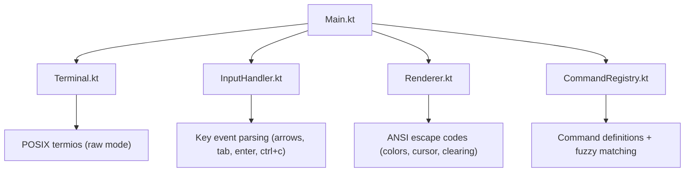

# idk — TUI Debugger (Phase 1: Shell & Input)

## Goal

Build the initial interactive TUI shell for `idk` using **Kotlin Native** (macOS ARM64). This first phase focuses on the terminal interface: ASCII logo, welcome text, command input with autocomplete suggestions, command history, and graceful Ctrl+C exit.

## System Environment

| Item | Value |
|------|-------|
| OS | macOS (ARM64) |
| Kotlin | 2.1.21 |
| Gradle | 8.14.2 |
| Target | `macosArm64` native executable |

## Architecture Overview

**No external TUI libraries** will be used. The entire TUI is built from scratch using:
- **POSIX `termios`** via `platform.posix` for raw terminal mode
- **ANSI escape codes** for colors, cursor positioning, and screen clearing

## Proposed Changes

### Build System

#### [NEW] [settings.gradle.kts](./idk/settings.gradle.kts)
- Root project name: `idk`

#### [NEW] [build.gradle.kts](./idk/build.gradle.kts)
- Plugin: `kotlin("multiplatform")` version `2.1.21`
- Target: `macosArm64("native")` with executable binary
- Entry point: `main`
- Base name: `idk`
- Opt-in: `kotlinx.cinterop.ExperimentalForeignApi`

#### [NEW] [gradle.properties](./idk/gradle.properties)
- Standard Kotlin Native properties

#### [NEW] Gradle Wrapper files
- `gradlew`, `gradlew.bat`, `gradle/wrapper/*`

---

### Source Code (`src/nativeMain/kotlin/`)

#### [NEW] [Main.kt](./idk/src/nativeMain/kotlin/Main.kt)
- Entry point `fun main()`
- Initializes `Terminal`, renders the welcome screen (logo + text + input box)
- Enters the main event loop:
  1. Read a key event from `InputHandler`
  2. Update state (current input buffer, suggestion list, selected suggestion index, command history)
  3. Call `Renderer` to redraw
- On exit: restore terminal and print goodbye

#### [NEW] [Terminal.kt](./idk/src/nativeMain/kotlin/Terminal.kt)
- `enableRawMode()` — saves original `termios`, sets raw mode via `cfmakeraw`, applies with `tcsetattr`
- `disableRawMode()` — restores saved `termios`
- `getTerminalSize(): Pair<Int, Int>` — queries terminal width/height via `ioctl` + `TIOCGWINSZ`
- RAII-style: always restore terminal on exit

#### [NEW] [InputHandler.kt](./idk/src/nativeMain/kotlin/InputHandler.kt)
- Reads raw bytes from STDIN
- Parses escape sequences into a sealed class `KeyEvent`:
  - `KeyEvent.Char(c: Char)` — printable character
  - `KeyEvent.Enter`
  - `KeyEvent.Tab`
  - `KeyEvent.Backspace`
  - `KeyEvent.ArrowUp` / `ArrowDown` / `ArrowLeft` / `ArrowRight`
  - `KeyEvent.CtrlC`
  - `KeyEvent.Unknown`

#### [NEW] [Renderer.kt](./idk/src/nativeMain/kotlin/Renderer.kt)
- Owns all ANSI output logic
- `renderWelcomeScreen()` — draws ASCII logo placeholder + welcome text
- `renderFrame(state: AppState)` — full redraw each frame:
  1. Clear screen (`\u001b[2J\u001b[H`)
  2. Draw ASCII logo (placeholder dots)
  3. Draw welcome text
  4. Draw command history (oldest first, above input)
  5. Draw Ctrl+C warning message if active
  6. Draw input box with border (`╭─╰─│`)
  7. Draw suggestion list below input box
- Color scheme:
  - User input text: **white** (`\u001b[97m`)
  - Placeholder text ("Type your command"): **dim gray** (`\u001b[90m`)
  - Suggestions (non-selected): **dim gray** (`\u001b[90m`)
  - Selected suggestion: **bright green** (`\u001b[92m`)
  - Command history prefix `> `: **dim gray**
  - Ctrl+C warning: **yellow** (`\u001b[93m`)
  - Box border chars: **dim gray** (`\u001b[90m`)

#### [NEW] [CommandRegistry.kt](./idk/src/nativeMain/kotlin/CommandRegistry.kt)
- Data class `Command(val name: String, val description: String)`
- Hardcoded list of initial commands:
  - `about` → "show version info"
  - `clear` → "clear the screen and history"
  - `help` → "list available commands"
  - `attach` → "attach to a running process"
  - `breakpoint` → "manage breakpoints"
  - `inspect` → "inspect an object in memory"
  - `modify` → "modify an attribute at runtime"
  - `quit` → "exit the debugger"
- `fun search(query: String): List<Command>` — returns commands that contain the query, sorted by:
  1. Commands that **start with** the query (alphabetically)
  2. Commands that **contain** the query elsewhere (alphabetically)

#### [NEW] [AppState.kt](./idk/src/nativeMain/kotlin/AppState.kt)
- Holds all mutable TUI state:
  - `inputBuffer: String` — current user input
  - `cursorPosition: Int` — cursor pos within the buffer
  - `suggestions: List<Command>` — current filtered suggestions
  - `selectedSuggestionIndex: Int` — which suggestion is highlighted (-1 = none)
  - `commandHistory: List<String>` — submitted commands (oldest first)
  - `ctrlCPressed: Boolean` — whether first Ctrl+C was pressed
  - `ctrlCTimestamp: Long` — when first Ctrl+C was pressed (for 1.5s timeout)
  - `running: Boolean` — main loop control flag

---

### Developer Logs

#### [NEW] [DEVELOPER_LOGS.md](./idk/DEVELOPER_LOGS.md)
- Error diary as requested — errors encountered and how they were solved

## Key Behaviors

### Input Box
- Shows placeholder "Type your command" in dim gray when buffer is empty
- User-typed text appears in white
- The `> ` prompt prefix is always visible inside the box

### Autocomplete
- Triggered on every keystroke (character add or backspace)
- If input is empty → no suggestions shown
- Suggestions appear **below** the input box
- First suggestion is pre-selected (bright green)
- Arrow Down/Up moves selection
- Tab or Enter (while suggestions are visible) fills the input with the selected command name
- After filling, suggestions disappear (the full command name won't partially match because it matches exactly — but we still show it if it's an exact match, so the user can press Enter to submit)

### Command Submission
- When no suggestions are visible and user presses Enter → the current input is submitted
- Submitted commands appear above the input box as `> command_name`
- Input buffer is cleared after submission

### Ctrl+C Exit Flow
1. First Ctrl+C → show "Press Ctrl+C again to exit." warning in yellow above the input box
2. The warning auto-dismisses after 1.5 seconds
3. Second Ctrl+C within 1.5s → exit the program (restore terminal first)
4. If 1.5s passes without second Ctrl+C → reset the warning state

## Open Questions

> [!IMPORTANT]
> **Gradle Wrapper**: Should I generate the Gradle wrapper using `gradle wrapper` command, or do you prefer to provide it? I'll generate it via `gradle wrapper` since you have Gradle 8.14.2 installed.

> [!NOTE]
> **Kotlin version alignment**: Your system has Kotlin 2.1.21. The Gradle plugin version in `build.gradle.kts` will use `2.1.21` to match. If you prefer a different version, please let me know.

## Verification Plan

### Automated Tests
1. **Build verification**: `./gradlew linkDebugExecutableNative` must succeed
2. **Run verification**: Execute the binary and interact with it via the browser terminal subagent:
   - Verify ASCII logo placeholder renders
   - Verify input box with border renders
   - Verify typing shows autocomplete suggestions
   - Verify arrow keys move selection
   - Verify Tab/Enter fills selected suggestion
   - Verify command submission adds to history
   - Verify double Ctrl+C exits

### Manual Verification
- The user can run `./build/bin/native/debugExecutable/idk.kexe` and interact with the TUI manually

Terminal.kt — Added a SIGWINCH signal handler via platform.posix.signal + staticCFunction. When the OS sends SIGWINCH (terminal resized), it sets Terminal.resized = true.

Main.kt — The Timeout handler now checks Terminal.resized on every poll cycle (~100ms). When detected, it clears the flag and triggers a full re-render. Since Renderer.render() already calls Terminal.getSize() each frame, the input box border automatically adapts to the new terminal width.

The TUI now responds to terminal resizing within ~100ms. You can test it by running the binary and dragging the terminal window edges — the input box border will stretch/shrink to match.